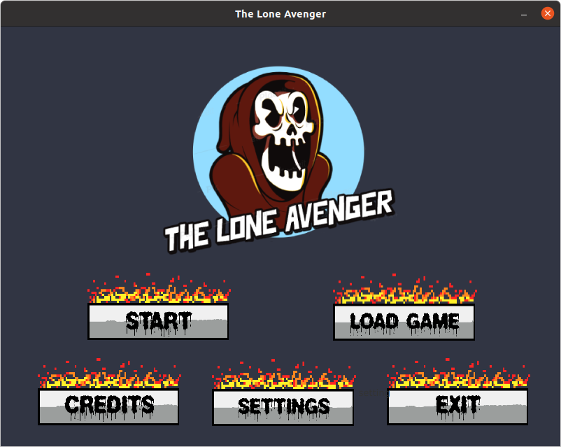
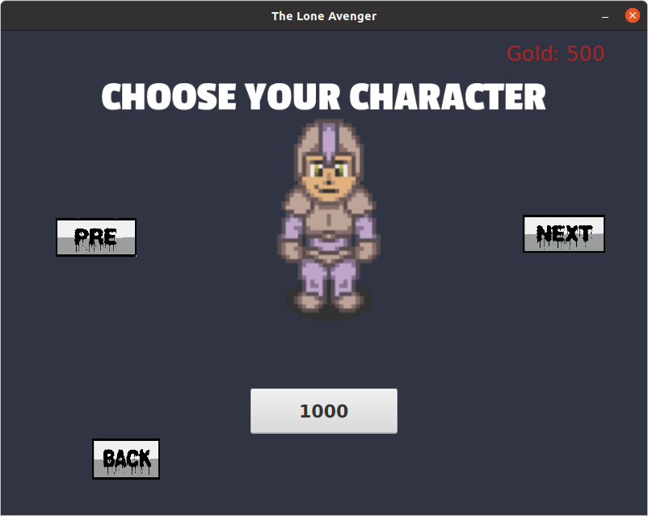
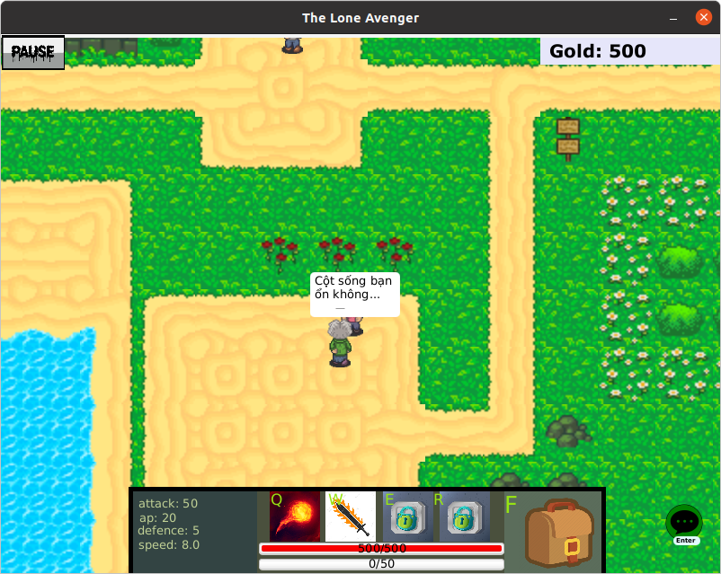
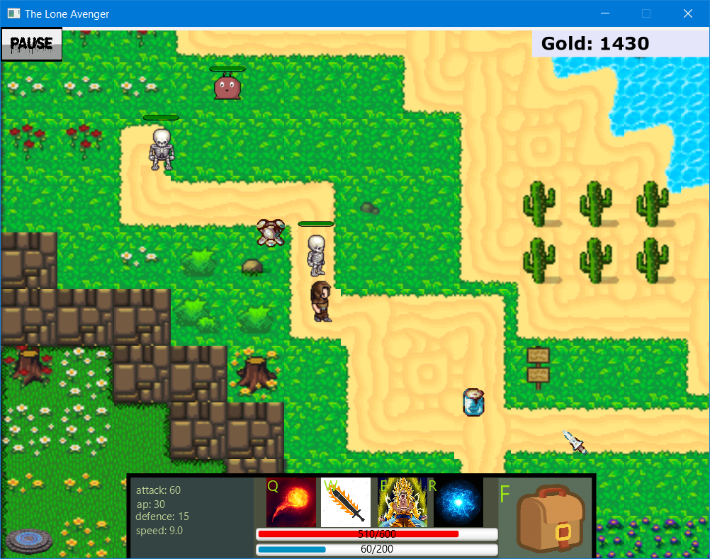
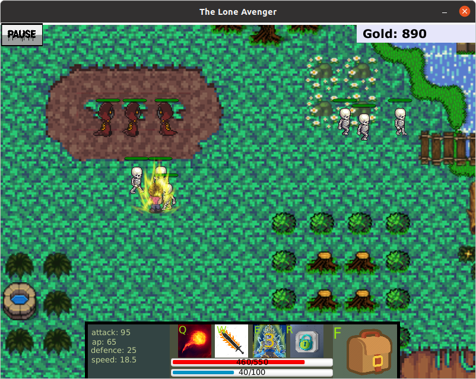
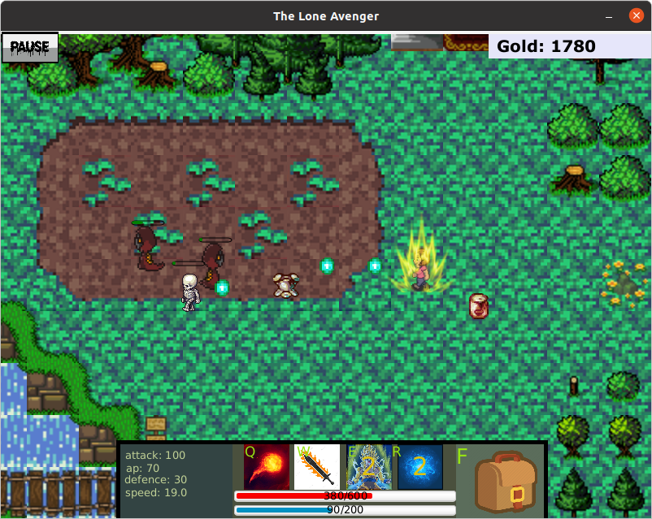
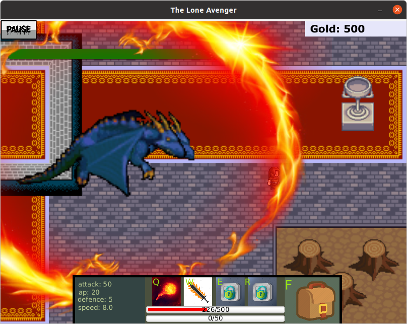

# The Lone Avenger - Tile game with javafx

(updated version of tileAboutGame)

##Details

**Created by**: [Ngô Trọng Quân](https://github.com/quybnz1), [Nguyễn Anh Tuấn](https://github.com/tuan30vh), [Ngô Đăng Hanh](https://github.com/hanh-nd), [Nguyễn Thanh Tùng](https://github.com/RoverNguyen), Lê Minh Hoàng

##Features

- 10 skins
- 3 mode: easy, medium, hard
- Many cool items
- Save and reload game
- 4 maps with a lot of interesting enemies, npc

##Screenshots









##Download and play

###Window

Download the zip file [here](https://github.com/quybnz1/tileGameFx/releases/download/v1.0/the-lone-avenger-win.zip)
After unzip the file, open bin folder and double click 'the-lone-avenger.bat' and enjoy :))

###Linux

Download the zip file [here](https://github.com/quybnz1/tileGameFx/releases/download/v1.0/the-lone-avenger-win.zip)
After unzip the file, open terminal in that file and navigate to bin folder:
```
cd bin
```
Then, execute the following command and enjoy :))
```
./the-lone-avenger
```

###Prerequisites

This version doesn't require a pre-existing Java runtime. This is possible because
the project takes advantage of jlink to create a custom runtime image which
comes bundled with the Java runtime.


